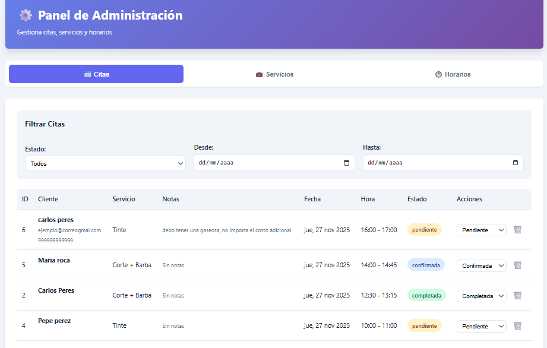
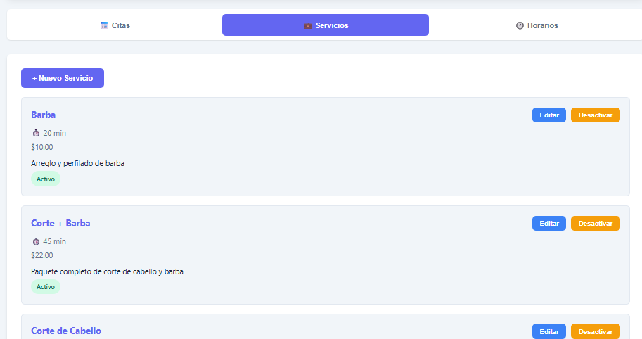
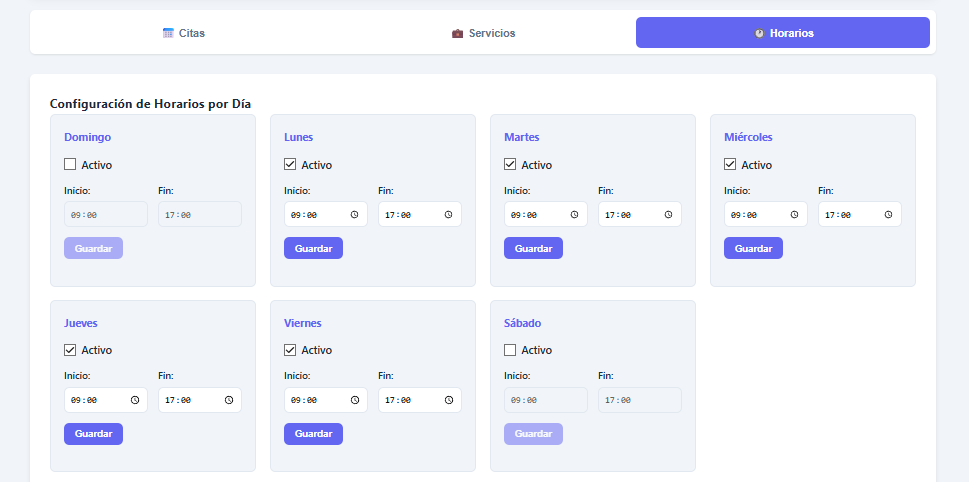
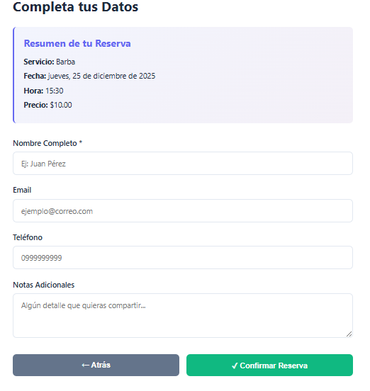
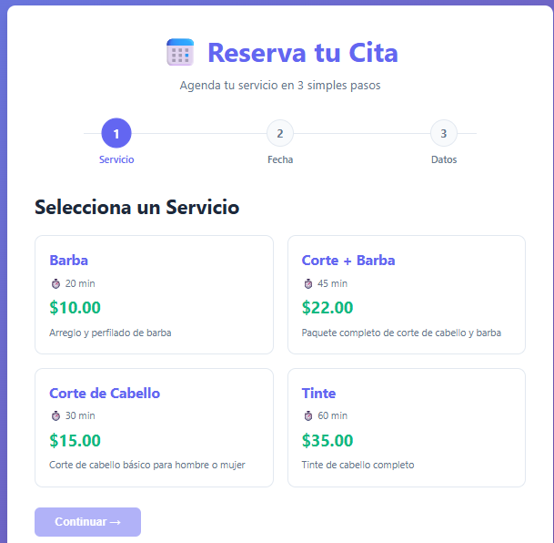

# 📅 Agendador de Citas MVP

**Plataforma White-Label escalable para automatizar la gestión de citas en negocios de servicios.**

## 🎯 Descripción

Módulo base, escalable y listo para reventa, diseñado para digitalizar y automatizar la gestión de citas en negocios de servicios como Barberías, Consultorios, o Salones. Desarrollado como Producto Mínimo Viable (MVP) para ser vendido como código fuente (White-Label).

## ✨ Características Principales

- ✅ **Gestión de Servicios** - Catálogo con nombres, duración y precios
- ✅ **Sistema de Citas** - Reserva con datos de cliente y validación de disponibilidad
- ✅ **Lógica de Bloqueo Inteligente** - Cálculo automático de franjas horarias disponibles
- ✅ **Horarios Configurables** - Gestión de horarios de trabajo por día
- ✅ **Interfaz de Reserva 3 pasos** - UX simple y clara (Servicio → Fecha → Hora)
- ✅ **White-Label** - Preparado para reventa como código fuente

## 🛠️ Stack Tecnológico

| Componente | Tecnología |
|-----------|-----------|
| **Backend** | Node.js + Express |
| **Frontend** | Vue.js |
| **Base de Datos** | PostgreSQL / MongoDB |
| **Manejo de Tiempo** | Luxon / Moment.js |

## � Demostración Visual

### Dashboard Administrativo

*Panel de control para administradores: gestión de servicios, horarios y citas.*

### Gestión de Servicios

*Interfaz para crear y editar servicios con duración y precios.*

### Configuración de Horarios

*Gestión de horarios de trabajo por día de la semana.*

### Reserva de Citas - Paso 1: Seleccionar Servicio

*Primera etapa: elección del servicio a reservar.*

### Reserva de Citas - Paso 2: Seleccionar Fecha

*Segunda etapa: selección de fecha disponible con calendario interactivo.*

### Listado de Citas

*Visualización de todas las citas confirmadas con detalles del cliente y servicio.*

## �🗺️ Roadmap

1. Estructura del Proyecto - `/backend` y `/frontend`
2. Implementación del Core - Lógica de cálculo de franjas
3. Documentación de Instalación - Despliegue

## 📊 Habilidades Demostradas

- 🔧 SaaS White-Label
- ⏱️ Lógica compleja de disponibilidad temporal
- 🎨 Frontend reactivo con Vue.js
- 🔐 API RESTful segura
- 📱 Interfaz responsiva

---

[Volver al Portfolio](../)
