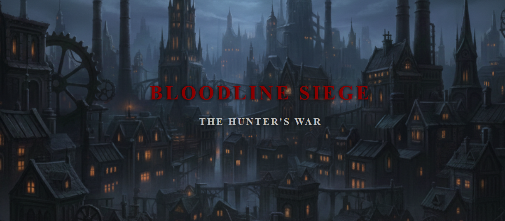
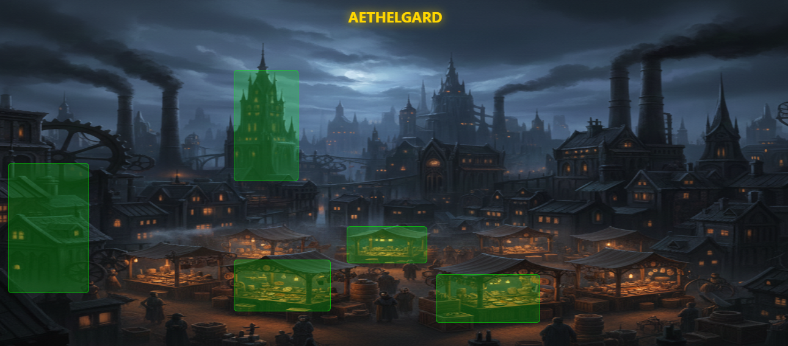

# 🎮 BLOODLINE: SIEGE THE HUNTERS WAR

**Juego estratégico PvP gótico-industrial con mecánicas de facción y progresión.**

## 🎯 Descripción

Juego de estrategia con estética gótica-industrial que combina la opulencia gótica con tecnología steampunk. Sistema de facción (Vampiros, Hombres Lobo, Cazadores) con mecánicas de combate, crafteo y progresión.

## ✨ Características Principales

- ✅ **3 Facciones Jugables** - Vampiros (Drenaje), Hombres Lobo (Furia), Cazadores (Crafteo)
- ✅ **Estética Gótica-Industrial** - Diseño visual coherente y envolvente
- ✅ **Sistema de Loot Tiers** - Rareza visual integrada en la paleta de colores
- ✅ **Interfaz Steampunk** - UI con marcos metálicos y texturas desgastadas
- ✅ **Iconografía de Facción** - Símbolos reconocibles por facción
- ✅ **Diseño Responsivo** - Adaptado para múltiples tamaños de pantalla

## 🎨 Guía Visual

| Aspecto | Descripción |
|---------|-----------|
| **Ambiente** | Oscuro, opresivo, elegante y funcional |
| **Arquitectura** | Gótica + Maquinaria de vapor (tuberías, engranajes) |
| **Materiales** | Hierro forjado, latón, cobre envejecido, terciopelo |
| **Paleta Base** | #1C1C1C (fondo), #EBEBEB (texto), #B22222 (acción) |

## � Demostración Visual

### Pantalla Principal del Juego

*Interfaz de combate con UI steampunk, indicadores de salud y recursos de facción.*

### Ciudad / Exploración

*Ambiente gótico-industrial donde se desarrolla la aventura, NPC y puntos de interés.*

## �🛠️ Stack Tecnológico

| Componente | Tecnología |
|-----------|-----------|
| **Motor Gráfico** | Canvas / Phaser |
| **Frontend** | JavaScript ES6+ |
| **Diseño UI** | CSS3 + Variables personalizadas |
| **Assets** | Diseño vectorial coherente |

## 📊 Habilidades Demostradas

- 🎨 Diseño visual coherente
- 🎮 Arquitectura de juegos
- 🎭 Sistema de facciones y progresión
- 📐 UI/UX gaming
- 🌍 Worldbuilding

---

[Volver al Portfolio](../)
