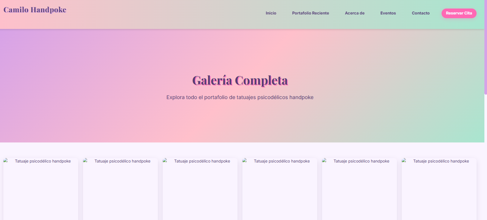
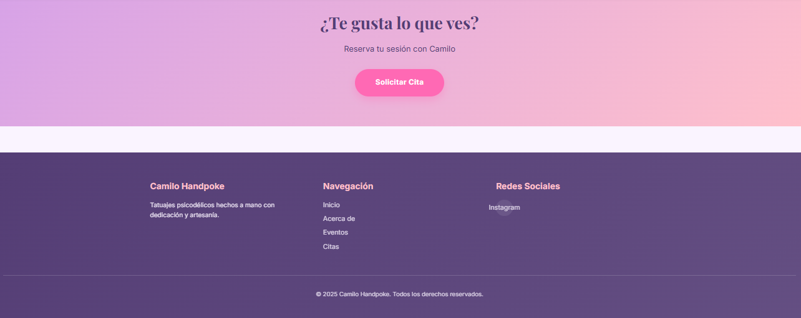

# 👨‍💼 Camilo Folio

**Portfolio personal y profesional con múltiples secciones y diseño moderno.**

## 🎯 Descripción

Sitio web de portfolio profesional que showcasea trabajos, servicios y citas. Diseñado como plataforma personal de presentación con navegación intuitiva y diseño responsivo.

## ✨ Características Principales

- ✅ **Página de Inicio** - Presentación principal y CTA
- ✅ **Sección de Citas** - Formulario de reserva de citas
- ✅ **Portfolio Completo** - Galería de trabajos anteriores
- ✅ **About Me** - Sección biográfica y profesional
- ✅ **Diseño Responsivo** - Mobile-first
- ✅ **Navegación Clara** - UX optimizada

## 🛠️ Stack Tecnológico

| Componente | Tecnología |
|-----------|-----------|
| **Frontend** | HTML5, CSS3, JavaScript vanilla |
| **Hosting** | Static site (GitHub Pages, Netlify, etc.) |
| **Diseño** | CSS Flexbox / Grid |
| **Assets** | Imágenes optimizadas |

## 📁 Estructura

```
camilo_folio/
├── index.html              # Página principal
├── about.html              # Sección About
├── citas.html              # Sistema de citas
├── portafolio-completo.html # Galería de trabajos
├── css/                    # Estilos
├── js/                     # Scripts
├── img/                    # Imágenes
└── assets/                 # Recursos adicionales
```

## � Demostración Visual

### Landing Page

*Página principal con presentación profesional y CTA (Call To Action).*

### Footer

*Sección de pie de página con contacto, redes sociales y navegación secundaria.*

## �📊 Habilidades Demostradas

- 🎨 Diseño UI/UX moderno
- 📱 Desarrollo responsivo
- 💼 Portfolio profesional
- 🔄 Navegación intuitiva
- ✨ Experiencia de usuario

---

[Volver al Portfolio](../)
