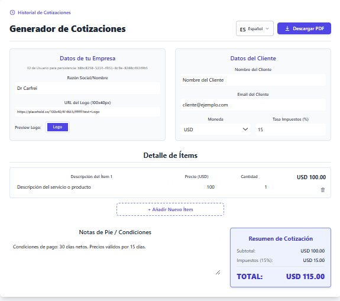
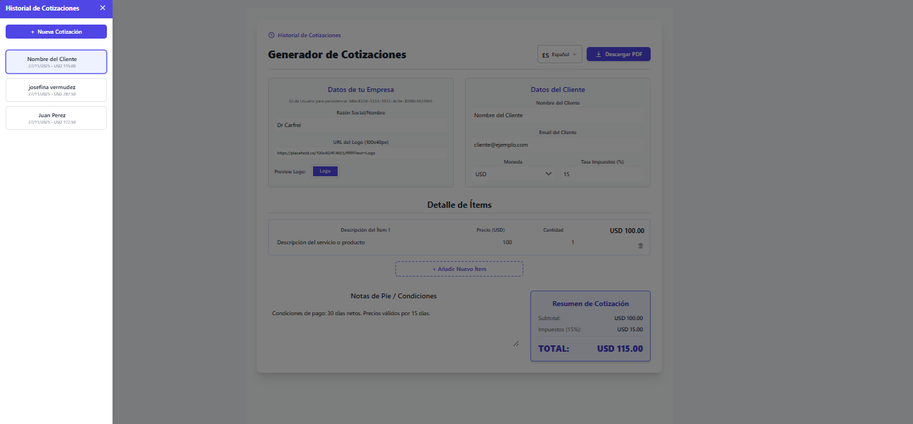

# 📋 Creador de Cotizaciones y Presupuestos

**Generador White-Label de presupuestos profesionales para servicios.**

## 🎯 Descripción

Herramienta para crear y gestionar cotizaciones y presupuestos profesionales. Disponible como solución White-Label lista para revender a agencias y freelancers que necesitan generar documentos profesionales rápidamente.

## ✨ Características Principales

- ✅ **Generador de Presupuestos** - Interfaz intuitiva para crear cotizaciones
- ✅ **Template Profesional** - Diseño premium y personalizable
- ✅ **Cálculo Automático** - Totales, impuestos y descuentos
- ✅ **Exportación PDF** - Documentos listos para enviar
- ✅ **White-Label Ready** - Personalizable con branding del cliente
- ✅ **Responsive** - Funciona en escritorio y móvil

## 🛠️ Stack Tecnológico

| Componente | Tecnología |
|-----------|-----------|
| **Frontend** | HTML5, CSS3, JavaScript vanilla |
| **Generación PDF** | html2pdf / pdfkit |
| **Almacenamiento** | LocalStorage / Backend |
| **UI Framework** | Bootstrap / CSS personalizado |

## � Demostración Visual

### Interfaz Principal

*Editor visual para crear cotizaciones profesionales.*

### Gestión de Ítems

*Agregar productos/servicios con precios, cantidades e impuestos automáticos.*

### Previsualización PDF

*Vista previa del documento final antes de exportar.*

## �📊 Habilidades Demostradas

- 💼 Soluciones B2B
- 📄 Generación de documentos
- 🎨 Diseño de templates profesionales
- 🔧 White-Label architecture
- 📊 Cálculos complejos en frontend

---

[Volver al Portfolio](../)
