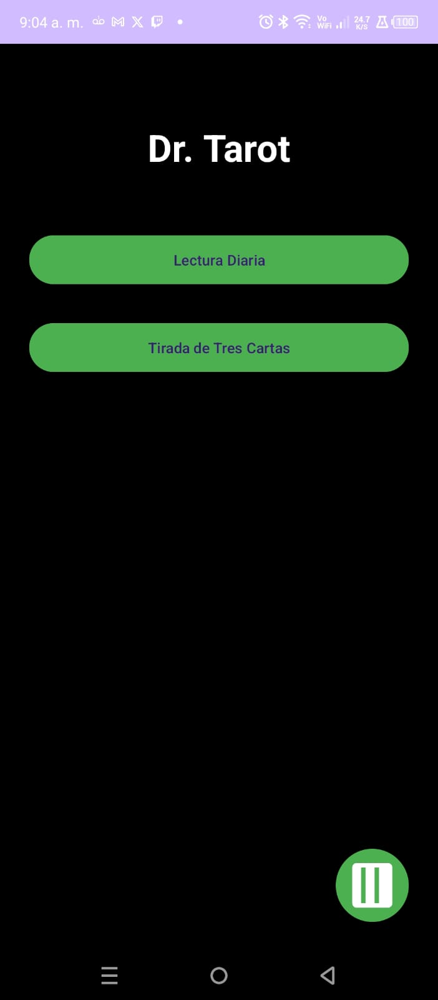
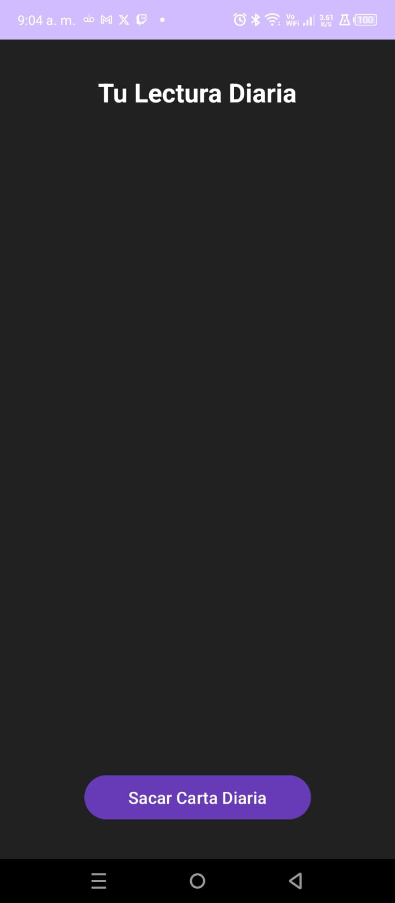
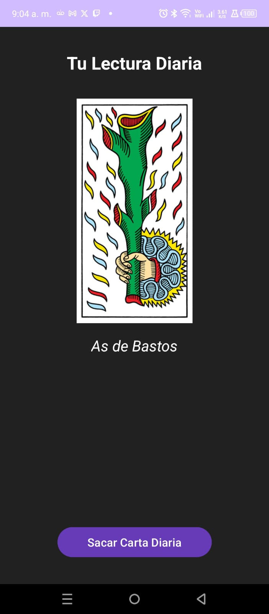
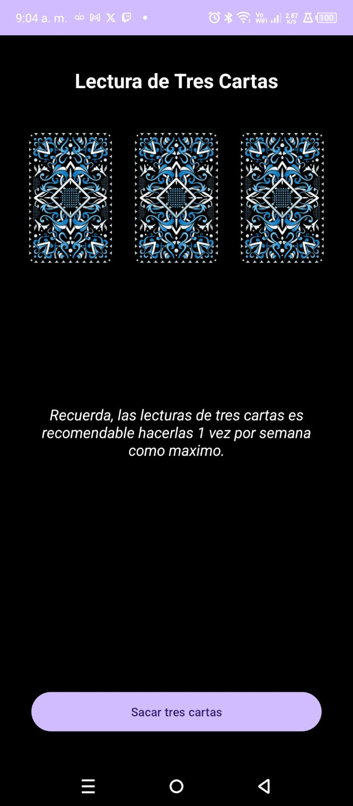
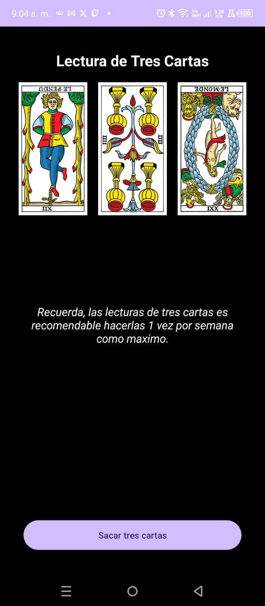
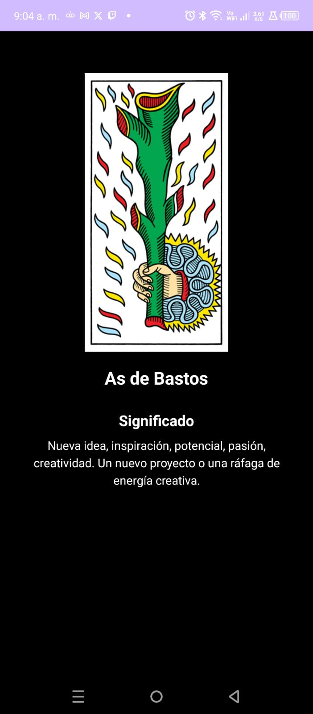
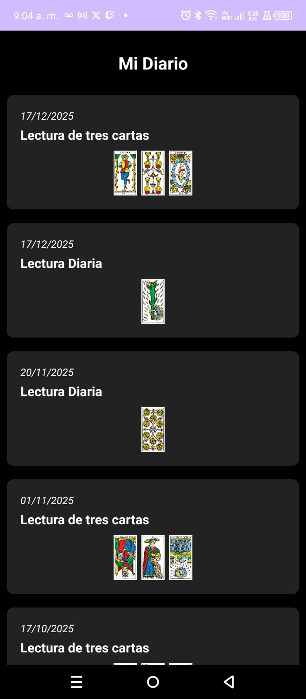

# 🔮 DrTarot

**Aplicación móvil de lecturas de Tarot.**

## 🎯 Descripción

Aplicación móvil desarrollada para lecturas y consultas de Tarot. Interfaz intuitiva que permite a los usuarios realizar tiradas y obtener interpretaciones.

## ✨ Características Principales

- ✅ **Lecturas de Tarot** - Tiradas con interpretaciones
- ✅ **Interfaz Intuitiva** - Fácil de usar
- ✅ **Diseño Responsivo** - Optimizado para móvil
- ✅ **Base de Datos de Cartas** - Baraja completa
- ✅ **Historial** - Guardar lecturas anteriores

## 🛠️ Stack Tecnológico

| Componente | Tecnología |
|-----------|-----------|
| **Desarrollo Móvil** | Java / Kotlin (Android) |
| **Build System** | Gradle |
| **Framework** | Android SDK |

## � Demostración Visual

### Menú Principal

*Pantalla de inicio con opciones principales de la aplicación.*

### Lectura Diaria

*Pantalla de lectura diaria con carta del día y su significado.*

### Primera Carta

*Visualización de la primera carta de la tirada.*

### Tirada de Tres Cartas

*Presentación de tirada clásica de tres cartas.*

### Detalle de la Tirada

*Expansión interactiva de la tirada de tres cartas.*

### Significado de la Carta

*Interpretación detallada y significado de la carta seleccionada.*

### Diario de Lecturas

*Historial de todas las lecturas realizadas con fechas y cartas.*

## �📊 Habilidades Demostradas

- 📱 Desarrollo Android nativo
- 🎨 Diseño UI/UX para móvil
- 📊 Gestión de datos
- 🔄 Persistencia de datos

---

[Volver al Portfolio](../)
