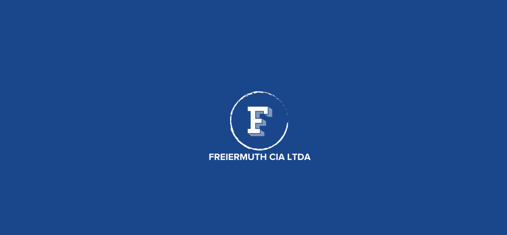
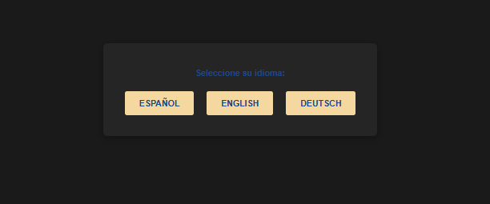
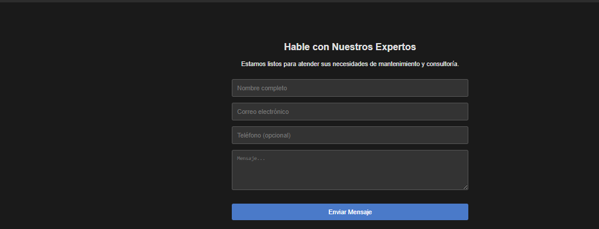

# 🏢 Freiermuth Cia LTDA - Auditoría DevOps

**Sitio corporativo con auditoría completa de DevOps y recomendaciones de seguridad.**

## 🎯 Descripción

Sitio web corporativo con sistema multiidioma (ES/EN/DE) e implementación de prácticas DevOps. Incluye auditoría completa de seguridad, CI/CD, testing y documentación detallada de mejoras.

## ✨ Características Principales

- ✅ **Multi-idioma** - Español, Inglés, Alemán
- ✅ **Landing Page Profesional** - Presentación corporativa
- ✅ **Auditoría DevOps Completa** - Análisis y recomendaciones
- ✅ **Security Hardening** - Mejoras de seguridad implementadas
- ✅ **Testing** - Suite de tests completada
- ✅ **Documentación Exhaustiva** - 11+ documentos técnicos

## 🛠️ Stack Tecnológico

| Componente | Tecnología |
|-----------|-----------|
| **Frontend** | HTML5, CSS3, JavaScript vanilla |
| **Backend** | Node.js / Express |
| **Multi-idioma** | i18n implementado |
| **Despliegue** | Render.com / Cloud providers |
| **Seguridad** | OWASP compliance |

## 📚 Documentación Incluida

**Cliente-facing (7 docs):**
- Reporte Ejecutivo
- Guía de Infraestructura
- Guía de Implementación (Acción Inmediata)
- Mejoras Técnicas Urgentes
- Arquitectura y Best Practices
- Checklist DevOps Profesional
- Índice de Documentación

**Técnica (2 docs):**
- Análisis DevOps Completo
- Refactorización de Código

## � Demostración Visual

### Splash / Inicio

*Pantalla de introducción con branding corporativo.*

### Selector de Idioma

*Interfaz para seleccionar idioma (Español, Inglés, Alemán).*

### Landing Page

*Página principal con presentación de servicios y propuesta de valor.*

### Formulario de Contacto

*Formulario de consulta con validación y envío seguro de datos.*

## �📊 Habilidades Demostradas

- 🔐 Security Auditing
- 🚀 DevOps & Infrastructure
- 📝 Documentación Técnica
- 🌍 Internacionalización (i18n)
- 📊 ROI & Business Analysis
- 🔧 Hardening & Best Practices

## 🎯 Resultados Auditoría

- **Score:** 3/10 (Antes)
- **Costo de Arreglarlo:** $15,750
- **Ahorro Anual Potencial:** $325,000
- **ROI:** 20.6x

---

[Volver al Portfolio](../)
