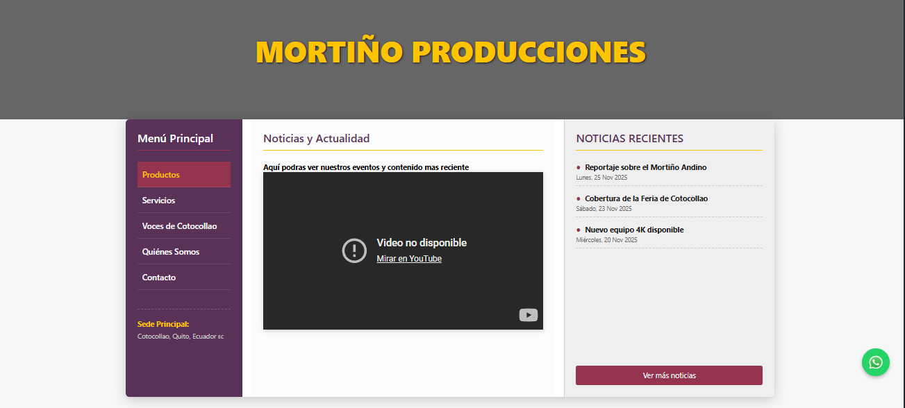

# 🎬 Mortino Producciones

**Plataforma de productora audiovisual y contenidos creativos.**

## 🎯 Descripción

Sitio web y plataforma para productora audiovisual. Showcase de proyectos, servicios de producción y gestión de contenidos multimedia.

## ⏸️ Estado del Proyecto

**Pausado** - Proyecto actualmente en pausa de desarrollo debido a restricciones presupuestarias. Se reanudará cuando se confirmen los compromisos de financiamiento del cliente.

## ✨ Características Principales

- ✅ **Galería de Proyectos** - Portfolio audiovisual
- ✅ **Showcases Multimedia** - Videos y fotos integradas
- ✅ **Servicios** - Catálogo de servicios de producción
- ✅ **Contacto** - Formulario de consultas
- ✅ **Blog** - Artículos y behind-the-scenes
- ✅ **Responsivo** - Optimizado para todos los dispositivos

## 🛠️ Stack Tecnológico

| Componente | Tecnología |
|-----------|-----------|
| **Frontend** | HTML5, CSS3, JavaScript |
| **Multimedia** | Video embedding (YouTube, Vimeo) |
| **Galerías** | Lightbox / Gallery plugins |
| **Hosting** | Static site o CMS |

## � Demostración Visual

### Landing Page

*Página principal con showcase de proyectos audiovisuales destacados.*

## �📊 Habilidades Demostradas

- 🎬 Diseño para industria creativa
- 🎨 Integración multimedia
- 📸 Optimización de galerías
- 📹 Video embedding
- 🎯 Portfolio presentation

---

[Volver al Portfolio](../)
