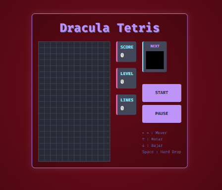

# 🧛‍♂️ Dracula Tetris

**Juego Tetris clásico con estética Dracula tema oscuro.**

## 🎯 Descripción

Reimaginación moderna del clásico Tetris con paleta de colores oficial Dracula y fondo "Rojo Aterciopelado". Desarrollado en JavaScript vanilla con HTML5 Canvas para máximo rendimiento.

## ✨ Características Principales

- ✅ **Mecánicas Clásicas** - Rotación, caída, líneas completas
- ✅ **Hard Drop** - Presiona Espacio para caída instantánea
- ✅ **Sistema de Puntuación** - Nivel dinámico y progresión
- ✅ **Detección de Colisiones** - Física precisa
- ✅ **Controles UI** - Botones de Inicio y Pausa
- ✅ **Tema Premium** - Paleta Dracula oficial

## 🎮 Controles

| Tecla | Acción |
|-------|--------|
| `←` `→` | Mover Izquierda / Derecha |
| `↑` | Rotar Pieza |
| `↓` | Soft Drop (bajar lento) |
| `Espacio` | Hard Drop (bajar rápido) |

## 🛠️ Stack Tecnológico

| Componente | Tecnología |
|-----------|-----------|
| **Rendering** | HTML5 Canvas |
| **Diseño** | CSS3 Flexbox |
| **Lógica** | JavaScript ES6+ |
| **Animaciones** | RequestAnimationFrame |

## 🎨 Diseño

- **Paleta:** Colores oficiales Dracula
- **Fondo:** Rojo Aterciopelado
- **Tipografía:** Legible en todos los tamaños
- **Responsivo:** Adaptado a múltiples pantallas

## � Demostración Visual

### Juego en Acción

*Pantalla principal del juego con piezas cayendo, score actual y próximas piezas.*

## �📊 Habilidades Demostradas

- 🎮 Desarrollo de juegos
- 🎨 Canvas graphics
- 📊 Física y colisiones
- ⚡ Optimización de rendimiento
- 🎯 Game loops
- 🔄 State management

---

[Volver al Portfolio](../)
