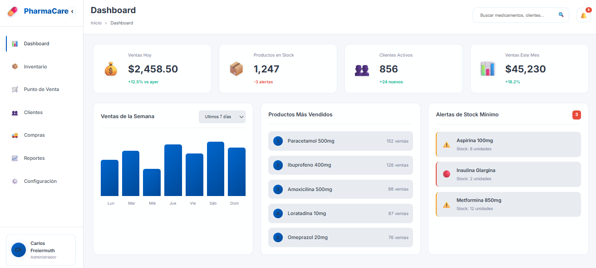
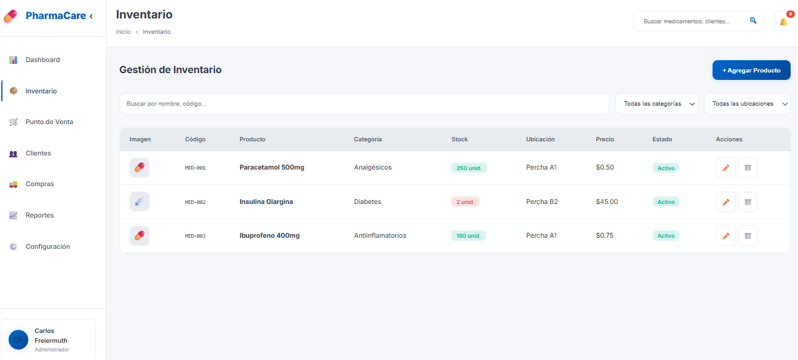
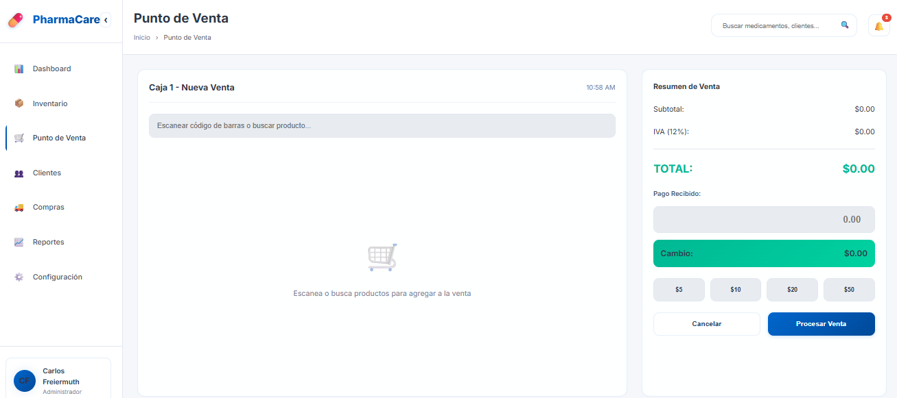
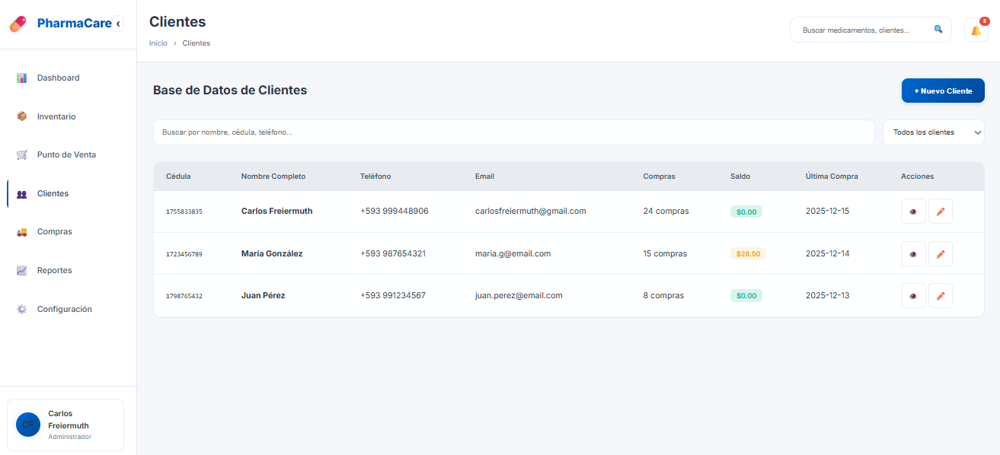
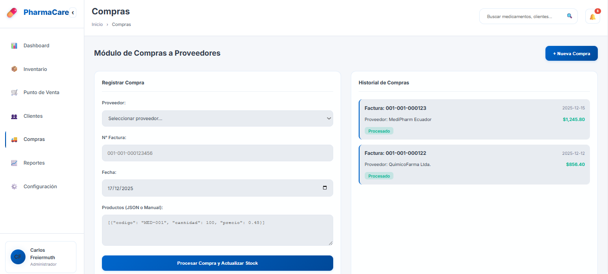
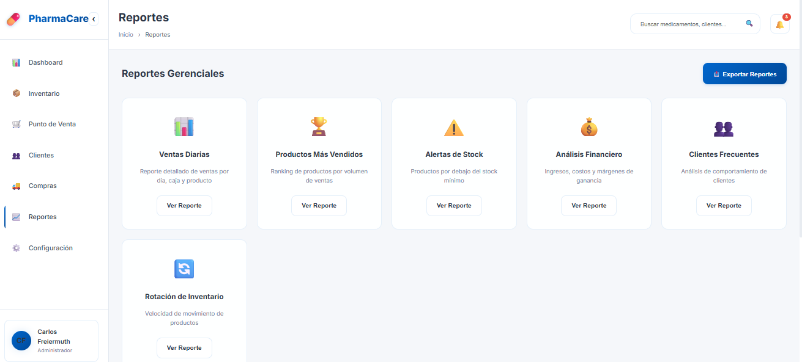
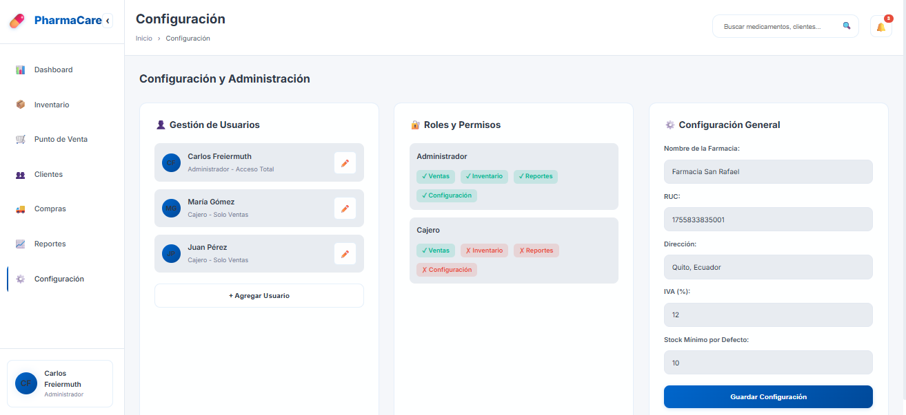

# 💊 PharmaCare ERP - Sistema de Gestión Farmacéutica

**Mockup funcional e interactivo de un sistema ERP completo para farmacias.**

🔗 **[Ver Demo en Vivo](https://pharmacy-management-system-gvrc.onrender.com)**

## 🎯 Descripción

PharmaCare ERP es un sistema completo de gestión farmacéutica diseñado como white-label para modernizar operaciones de farmacias. Incluye módulos de inventario, punto de venta, gestión de clientes, compras, reportes gerenciales y configuración administrativa.

## ✨ Características Principales

- ✅ **Dashboard Gerencial** - KPIs de ventas, productos top y alertas de stock
- ✅ **Gestión de Inventario** - Control de medicamentos, stock mínimo y alertas
- ✅ **Punto de Venta (POS)** - Sistema de cajas con búsqueda y escaneo de productos
- ✅ **Gestión de Clientes** - Base de datos con historial de compras
- ✅ **Módulo de Compras** - Registro de compras a proveedores
- ✅ **Reportes Gerenciales** - Ventas, análisis financiero, rotación de inventario
- ✅ **Configuración** - Usuarios, roles, permisos y ajustes del sistema
- ✅ **Diseño Responsivo** - Interfaz limpia inspirada en Fybeca
- ✅ **Tema Claro** - UI profesional con paleta de colores corporativa

## 🛠️ Stack Tecnológico

| Componente   | Tecnología                      |
| ------------ | ------------------------------- |
| **Frontend** | HTML5, CSS3, JavaScript vanilla |
| **UI/UX**    | Diseño profesional white-label  |
| **Gráficos** | Interactividad con JavaScript   |
| **Hosting**  | Render.com                      |

## 🏥 Módulos del Sistema

### 📊 Dashboard
- Resumen de ventas semanales
- Productos más vendidos
- Alertas de stock mínimo
- KPIs en tiempo real

### 📦 Inventario
- CRUD completo de medicamentos
- Control de stock y lotes
- Alertas automáticas de reabastecimiento
- Categorización de productos

### 🛒 Punto de Venta
- Sistema de cajas múltiples
- Búsqueda y escaneo de productos
- Cálculo automático de totales
- Gestión de métodos de pago

### 👥 Clientes
- Base de datos con cédula/RUC
- Historial de compras
- Análisis de clientes frecuentes

### 🚚 Compras
- Registro de compras a proveedores
- Historial de pedidos
- Control de costos

### 📈 Reportes
- Ventas diarias y mensuales
- Análisis financiero completo
- Rotación de inventario
- Cierre de caja diario

### ⚙️ Configuración
- Gestión de usuarios
- Roles y permisos
- Configuración general del sistema

## 🎨 Demostración Visual

### Dashboard Principal

*Vista general con KPIs, ventas semanales y alertas de stock mínimo.*

### Gestión de Inventario

*Control completo de medicamentos con stock, lotes y alertas de reabastecimiento.*

### Punto de Venta

*Sistema de caja con búsqueda de productos y cálculo automático de totales.*

### Base de Clientes

*Gestión de clientes con historial de compras y datos de contacto.*

### Módulo de Compras

*Registro de compras a proveedores con historial completo.*

### Reportes Gerenciales

*Panel de reportes con análisis de ventas, productos y finanzas.*

### Configuración del Sistema

*Gestión de usuarios, roles, permisos y configuraciones administrativas.*

## 📊 Habilidades Demostradas

- 💊 Healthcare / Pharmacy domain knowledge
- 🏪 ERP system design
- 📊 Business intelligence y reportes
- 💰 Gestión de inventario y ventas
- 👥 Multi-user systems
- 🎨 UI/UX para aplicaciones corporativas
- 🌐 White-label product design

## 🇪🇨 Características Ecuador

- ✅ Validación de cédulas ecuatorianas
- ✅ Formato de RUC con dígito verificador
- ✅ Normativas locales de facturación
- ✅ Localización completa en español

---

[Volver al Portfolio](../)
