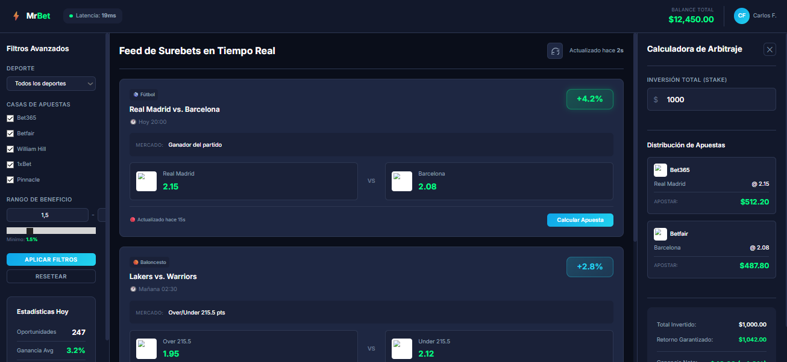

# 💰 Mr Bet - Arbitraje Deportivo en Tiempo Real

**Mockup funcional e interactivo de una plataforma profesional de arbitraje deportivo (surebets).**

🔗 **[Ver Demo en Vivo](https://mr-bet.onrender.com)**

## 🎯 Descripción

> [!NOTE]
> Este es un **mockup de ejemplo** creado como demostración de habilidades técnicas y de diseño. El proyecto está **inspirado en trabajos anteriores realizados** en el ámbito de plataformas de arbitraje deportivo y trading.

Mr Bet es una plataforma profesional de arbitraje deportivo que muestra oportunidades de apuestas en tiempo real. El diseño está inspirado en dashboards de inversión como Bloomberg y Binance, ofreciendo una interfaz limpia, moderna y centrada en datos.

Este mockup funcional sirve como **proyecto de portafolio** para demostrar capacidades en desarrollo frontend, diseño de interfaces complejas y conocimiento del dominio de sports betting.

## ✨ Características Principales

- ✅ **Feed de Surebets** - Oportunidades de arbitraje actualizadas en tiempo real
- ✅ **Calculadora Integrada** - Distribución automática de apuestas según cuotas
- ✅ **Filtros Avanzados** - Por deporte, casas de apuestas y rango de beneficio
- ✅ **Dashboard Profesional** - Indicadores de latencia, balance y estadísticas
- ✅ **Indicadores Visuales** - Frescura de datos (verde, amarillo, rojo)
- ✅ **Comparación de Cuotas** - Visualización entre diferentes casas de apuestas
- ✅ **Tema Oscuro Premium** - Estética glassmorphism con acentos neón
- ✅ **Diseño Responsivo** - Adaptable a diferentes tamaños de pantalla

## 🛠️ Stack Tecnológico

| Componente     | Tecnología                      |
| -------------- | ------------------------------- |
| **Frontend**   | HTML5, CSS3, JavaScript vanilla |
| **UI/UX**      | Glassmorphism, modo oscuro      |
| **Tipografía** | Inter (Google Fonts)            |
| **Hosting**    | Vercel                          |

## 🎲 Funcionalidades del Sistema

### 📊 Feed de Surebets
- Visualización de oportunidades de arbitraje deportivo
- Actualización constante de datos
- Información detallada: deporte, equipos, horario y mercado
- Indicadores de frescura temporal

### 🧮 Calculadora de Arbitraje
- Distribución automática de apuestas
- Cálculo de ganancia neta y porcentaje de retorno
- Actualización en tiempo real basada en inversión total
- Visualización clara de distribución por casa de apuestas

### 🔍 Sistema de Filtros
- Filtrado por deporte (Fútbol, Baloncesto, Tenis, Béisbol, Hockey)
- Selección de casas de apuestas (Bet365, Betfair, William Hill, 1xBet, Pinnacle)
- Rango de beneficio configurable (mínimo y máximo)
- Estadísticas del día en panel lateral

### 📈 Dashboard
- Indicador de latencia en tiempo real
- Balance total visible en header
- Perfil de usuario personalizado
- Badges de rentabilidad codificados por color

## 🎨 Demostración Visual

*Vista general de la plataforma Mr Bet mostrando el feed de surebets, calculadora y sistema de filtros.*

## 📊 Habilidades Demostradas

- 💰 Sports betting & arbitrage domain knowledge
- 📊 Real-time data visualization
- 🎨 Modern dashboard design (Bloomberg/Binance style)
- 🧮 Mathematical calculations (arbitrage formulas)
- 🎯 Advanced filtering systems
- 💎 Premium UI/UX with glassmorphism
- ⚡ Performance optimization

## 🎨 Diseño

### Paleta de Colores
- **Fondo principal**: `#0a0e1a` (Azul oscuro profundo)
- **Fondo de tarjetas**: `rgba(255, 255, 255, 0.03)` (Glassmorphism)
- **Acento primario**: `#00ff88` (Verde neón)
- **Acento secundario**: `#00d4ff` (Azul eléctrico)
- **Texto principal**: `#e8eaf0` (Blanco suave)
- **Texto secundario**: `#8b92ab` (Gris azulado)

### Indicadores de Rentabilidad
- 🟢 **Alta** (≥3.5%): Verde brillante
- 🟡 **Media** (2-3.5%): Amarillo
- 🔵 **Baja** (<2%): Azul

---

[Volver al Portfolio](../)
