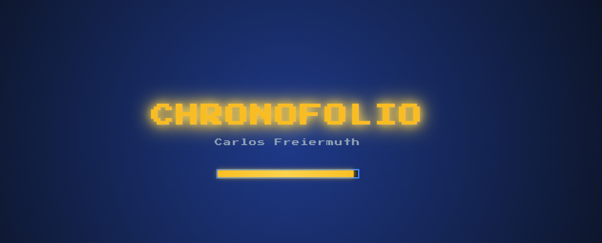

# 🕹️ ChronoFolio - Portafolio Retro 16-Bits

**Portafolio interactivo con temática retro 16-bits estilo arcade. Una experiencia única que combina un portafolio profesional con un videojuego estilo RPG.**

## 🎯 Descripción

**ChronoFolio** es una plataforma de presentación personal donde Carlos Freiermuth muestra sus proyectos y habilidades a través de una experiencia gamificada. En lugar de un portafolio tradicional, los visitantes exploran el contenido como si estuvieran jugando un videojuego retro de los 80s.

## ✨ Características Principales

- ✅ **Interfaz Retro 8-Bits** - Diseño nostálgico inspirado en arcades clásicos
- ✅ **Experiencia Gamificada** - Portafolio presentado como videojuego RPG
- ✅ **Sistema de Batalla** - Mecánicas de combate para explorar proyectos
- ✅ **Starfield Animado** - Efectos visuales con Canvas API
- ✅ **Audio Retro** - Música y sonidos 8-bits personalizados
- ✅ **Sistema de Diálogos** - Narrativa interactiva del portafolio
- ✅ **Gestión de Sprites** - Sistema modular de personajes y UI

## 🎮 Estados del Juego

| Estado | Descripción |
|--------|-------------|
| **SPLASH** | Pantalla de carga inicial (3 seg) |
| **PRESS_START** | Pantalla temática de arcade clásica |
| **BATTLE** | Pantalla principal - Sistema de batalla RPG |

## 🛠️ Stack Tecnológico

| Componente | Tecnología |
|-----------|-----------|
| **Frontend** | HTML5, CSS3, JavaScript vanilla |
| **Gráficos** | Canvas API (Starfield) |
| **Audio** | Web Audio API |
| **Diseño Responsivo** | CSS3 Flexbox |
| **Tipografía** | Google Fonts - Press Start 2P |
| **Despliegue** | Render.com |

## 🎨 Diseño Visual

- **Pantalla de Splash:** Barra de carga con branding
- **Press Start Screen:** Starfield animado + invitación arcade
- **Battle Screen:** Interfaz RPG con portafolio interactivo
- **Paleta:** Colores limitados estilo 8-bits
- **Animaciones:** Transiciones suaves y efectos pixel

## 📸 Demostración Visual

### Splash Screen

*Pantalla inicial con animación de carga.*

### Press Start Screen

*Pantalla de arcade clásica con starfield animado.*

### Battle Screen

*Interfaz RPG - Presentación del portafolio.*

## 📊 Habilidades Demostradas

- 🎮 Desarrollo de juegos / Game loops
- 🎨 Canvas graphics & animaciones
- 🎼 Gestión de audio web
- 💬 Sistemas de diálogos
- 🌌 Efectos visuales avanzados
- 🔄 State management & transiciones
- 📱 Diseño responsivo retro

## 🚀 Cómo Usar

1. Abre `index.html` en navegador moderno
2. Espera pantalla de splash (3 segundos)
3. Presiona cualquier tecla o click para continuar
4. ¡Explora el portafolio como videojuego retro!

## 🎮 Controles

| Acción | Control |
|--------|---------|
| Continuar/Seleccionar | Cualquier tecla o click |
| Navegar | Flechas de dirección |
| Confirmar | Enter o click |

---

[Volver al Portfolio](../)
